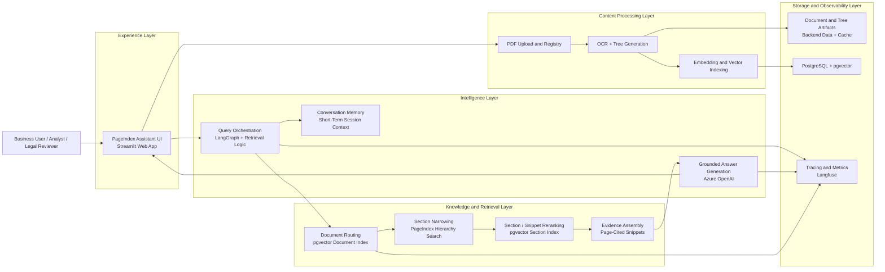
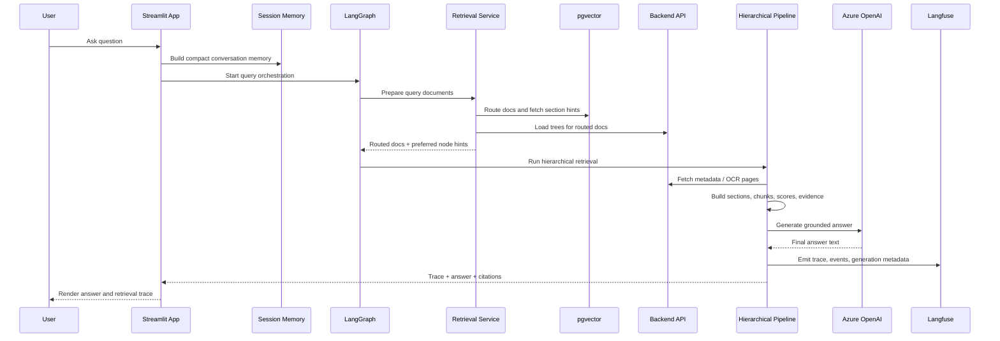
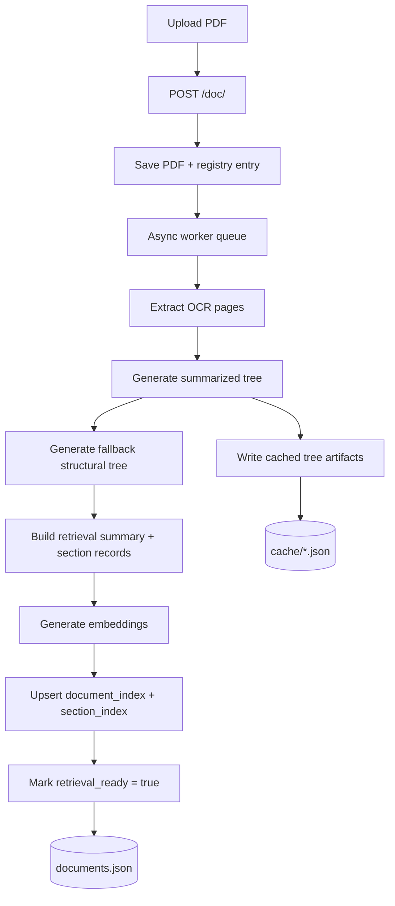

# PageIndex Architecture

This document presents the system at two levels:

- A high-level business architecture diagram for product, delivery, and leadership discussions.
- A low-level technical architecture diagram for engineering, platform, and support teams.

The current architecture reflects the implemented stack in this repository as of March 2026: Streamlit UI, FastAPI backend, Azure OpenAI for generation plus embeddings, pgvector for retrieval indexing and reranking, LangGraph for orchestration, Langfuse for tracing, and in-process caching plus session memory inside the app.

## 1. High-Level Architecture

### Purpose

Use this view when the audience cares about business capabilities, system responsibilities, and platform boundaries rather than function names or code paths.



### Business Interpretation

- Users interact with a single assistant experience rather than multiple tools.
- Uploaded PDFs are processed into structured knowledge assets, not just stored as raw files.
- Query handling is staged: route relevant documents first, narrow to sections next, then answer from cited evidence.
- The model is not expected to search the whole corpus directly; retrieval reduces scope before generation.
- Tracing and observability are part of the product operating model, not an afterthought.

### Business Capability Map

| Capability | Business Value | Primary Implementation |
|---|---|---|
| Document onboarding | New PDFs become searchable and answerable | FastAPI backend + background workers |
| Structured retrieval | Better accuracy than naive full-text search | PageIndex tree + chunk hierarchy |
| Scalable corpus routing | Keeps large corpora queryable | pgvector document index |
| Follow-up handling | Supports conversational use cases | Session memory in Streamlit app |
| Grounded answers | Reduces hallucination risk | Evidence assembly + cited answer prompt |
| Operational visibility | Enables debugging, tuning, and governance | Langfuse traces and metrics |

## 2. Low-Level Technical Architecture

### Purpose

Use this view when the audience needs concrete data flow, component interactions, and deployment/runtime boundaries.

```mermaid
flowchart TD
    user[User]
    ui[streamlit_app/app.py\nStreamlit UI]
    config[streamlit_app/config.py\nRuntime Config]

    subgraph app_runtime[Application Runtime]
        memory[rag/memory.py\nSession Memory Builder]
        retrieval[services/retrieval.py\nDocument Routing + Section Hints]
        graph[rag/langgraph_orchestrator.py\nLangGraph Query Graph]
        pipeline[rag/pipeline.py\nHierarchical Retrieval + Answer Path]
        prompts[rag/prompts.py\nPrompt Builders]
        observer[services/observer.py\nLangfuse Adapter]
        apiClient[services/pageindex_api.py\nBackend API Client]
        llm[services/azure_llm.py\nAzure Chat Client]
        cache[cache.py\nLRU + TTL Caches]
        embedUtil[embedding_utils.py\nAzure Embedding Client]
    end

    subgraph backend_runtime[Backend Runtime]
        fastapi[pageindex_backend/main.py\nFastAPI + Workers]
        worker[Background Worker Queue]
        tree[Tree Generation\nLLM Tree + Fallback Tree]
        indexer[pageindex_backend/retrieval_index.py\npgvector Indexer]
    end

    subgraph persistence[Persistence]
        data[(pageindex_backend/data\ndocuments.json + PDFs)]
        artifactCache[(pageindex_backend/cache\nTree Cache Files)]
        pg[(PostgreSQL + pgvector\ndocument_index + section_index)]
        lf[(Langfuse Cloud)]
    end

    user --> ui
    ui --> config
    ui --> memory
    ui --> graph
    graph --> retrieval
    graph --> pipeline
    retrieval --> embedUtil
    retrieval --> apiClient
    retrieval --> pg
    pipeline --> apiClient
    pipeline --> prompts
    pipeline --> llm
    pipeline --> cache
    pipeline --> observer
    observer --> lf

    ui --> apiClient
    apiClient --> fastapi

    fastapi --> worker
    worker --> tree
    tree --> artifactCache
    tree --> data
    worker --> indexer
    indexer --> embedUtil
    indexer --> pg
    fastapi --> data
```

### Technical Interpretation

- The Streamlit app owns query orchestration, session memory, answer generation, and trace rendering.
- The FastAPI backend owns document persistence, background processing, OCR, tree creation, and vector indexing.
- pgvector is split into two retrieval roles:
  - `document_index` for document-level routing.
  - `section_index` for section-level hints and reranking.
- LangGraph currently orchestrates the query path but still delegates actual retrieval and answering to the existing retrieval service and RAG pipeline.
- Langfuse is attached through an observer adapter, which lets the app keep running if tracing is disabled.

## 3. Runtime Query Flow

This is the practical query path used by the current implementation.



## 4. Runtime Ingestion Flow

This is the path that converts a PDF into retrieval-ready assets.



## 5. Alignment Summary

This table is useful for stakeholder reviews where people need a quick statement of what each architecture concern maps to in the implementation.

| Concern | Current State | Key Files |
|---|---|---|
| UI and user workflow | Implemented | `streamlit_app/app.py` |
| Short-term memory | Implemented | `streamlit_app/rag/memory.py` |
| In-process caching | Implemented | `streamlit_app/cache.py`, `streamlit_app/services/pageindex_api.py`, `streamlit_app/rag/pipeline.py` |
| LangGraph orchestration | Implemented | `streamlit_app/rag/langgraph_orchestrator.py` |
| Structured section retrieval | Implemented | `streamlit_app/rag/pipeline.py` |
| pgvector document routing | Implemented, active when thresholds/config permit | `streamlit_app/services/retrieval.py` |
| pgvector section reranking | Implemented, active when section index exists | `streamlit_app/services/retrieval.py` |
| Embedding generation | Implemented | `embedding_utils.py`, `pageindex_backend/retrieval_index.py` |
| Vector indexing on ingest | Implemented | `pageindex_backend/main.py`, `pageindex_backend/retrieval_index.py` |
| Trace and metrics export | Implemented | `streamlit_app/services/observer.py` |

## 6. Audience Guidance

- Use the high-level diagram in product reviews, design sign-off meetings, and stakeholder updates.
- Use the low-level diagram in engineering handoff, operations review, and debugging discussions.
- Use the runtime query and ingestion diagrams when analyzing performance, quality, or failure points.
